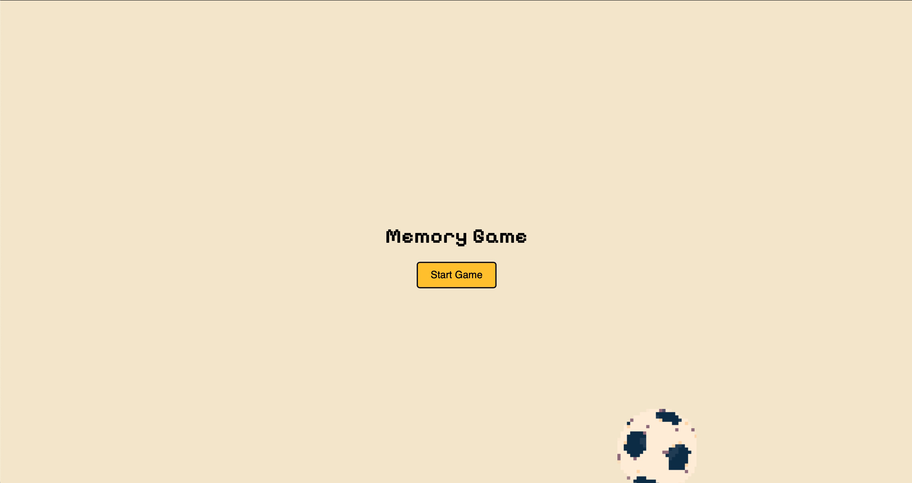
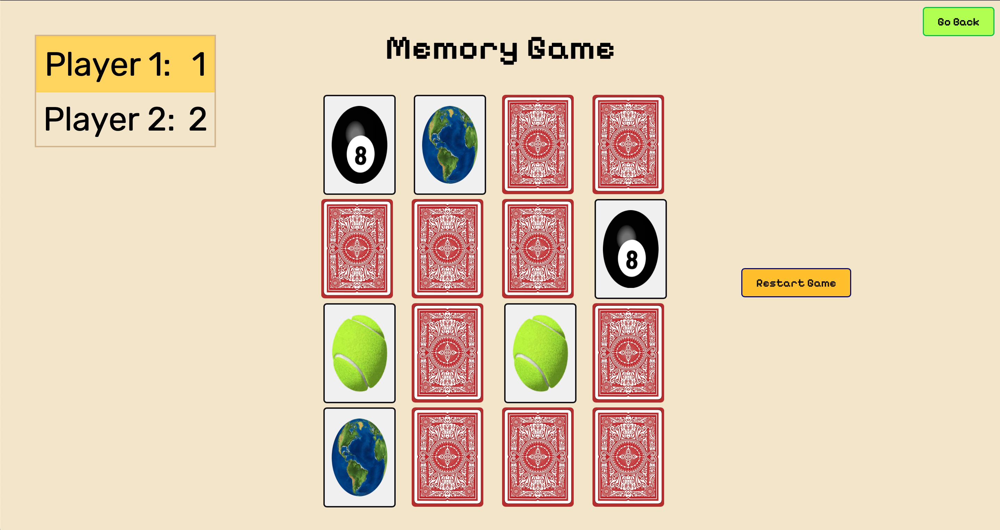

# memorizingGame
A game where you keep flipping cards until you get a match repeatedly.
The game was originally inspired from when I was a kid, 神経衰弱.

- Menu Page before starting

- A showcase of the game. The person that can flip the most pairs is the winner.

Utilized JavaScript to design and animate this game.

