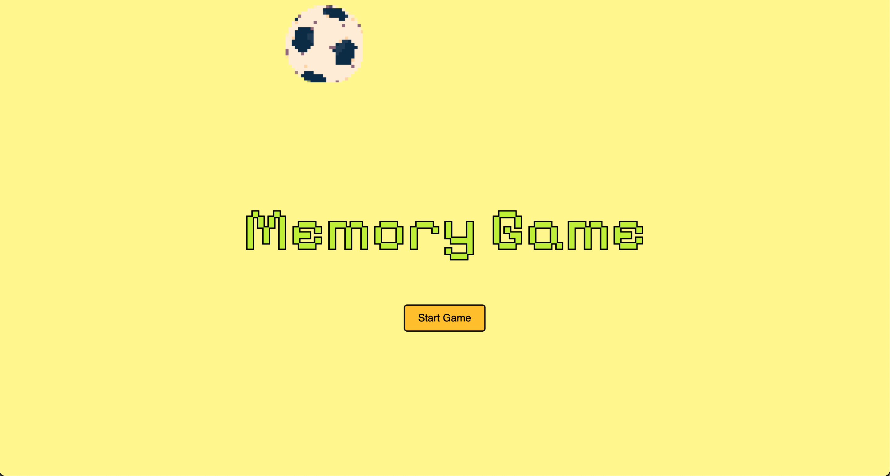

# Memorizing Game（神経衰弱） using Javascript
This is a game where you continuously flip cards until you find matching pairs, inspired by the childhood game 神経衰弱.

- Menu Page before starting

- A preview of the game. The player who can flip the most pairs becomes the winner.

JavaScript, HTML and CSS was employed for the design and animation of this game.
