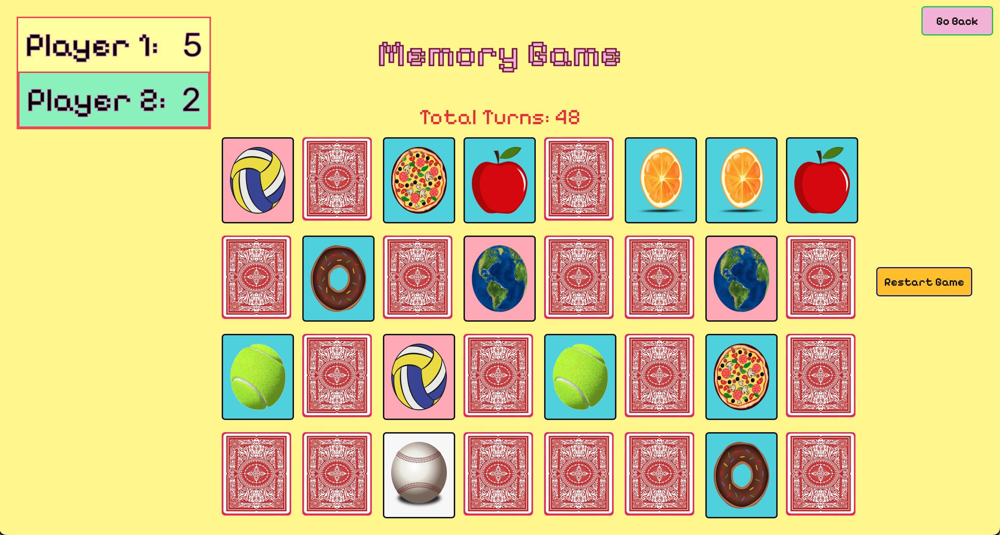

# Memorizing Game using Javascript
Welcome to the Memory Card Game. Test your memory and concentration as you flip cards to find matching pairs. JavaScript, HTML, and CSS come together to create an engaging and visually appealing gaming experience.

## How to play
- Click on cards to flip them.
- Match pairs to score points.
- The player with the most pairs wins!
Are you ready to challenge your memory skills? Click to start the game now!

### Menu Page

### Gameplay Preview

## Technologies Used
- JavaScript: Powers the game's logic and interactivity, and dealt with certain animations.
- HTML: Provides the structure for the web page.
- CSS: Enhances the visual aesthetics and animations.

## Features
- Interactive and animated design.
- Player-friendly menu page.
- Real-time gameplay with dynamic card flipping
